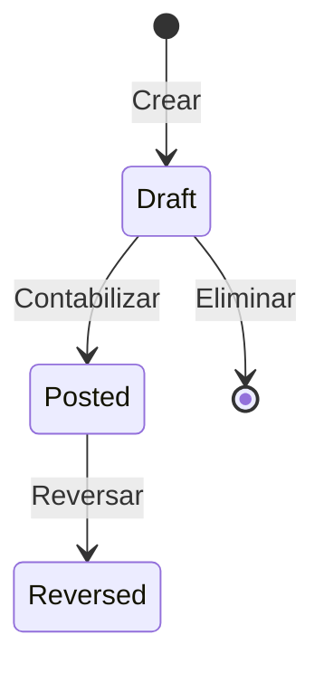

# Módulo de Contabilidad - Documentación Técnica

Este documento describe la arquitectura, componentes y uso del módulo de contabilidad de MAED Logistic Platform.

---

## Índice

1. [Arquitectura](#arquitectura)
2. [Plan de Cuentas](#plan-de-cuentas)
3. [Asientos Contables](#asientos-contables)
4. [Períodos Contables](#períodos-contables)
5. [Reportes Financieros](#reportes-financieros)
6. [Conciliación Bancaria](#conciliación-bancaria)
7. [Auditoría](#auditoría)
8. [Permisos](#permisos)

---

## Arquitectura

### Estructura de Archivos

```
app/
├── Http/Controllers/Accounting/
│   ├── AccountController.php           # CRUD Plan de Cuentas
│   ├── JournalEntryController.php      # CRUD + Post/Reverse Asientos
│   ├── AccountingPeriodController.php  # Gestión de Períodos
│   ├── GeneralLedgerController.php     # Libro Mayor
│   ├── FinancialReportsController.php  # Balance General, Estado Resultados
│   ├── BankReconciliationController.php # Conciliación Bancaria
│   ├── AccountingSettingController.php # Configuración
│   └── AuditLogController.php          # Logs de Auditoría
├── Services/
│   ├── JournalPostingService.php       # Lógica de contabilización
│   ├── FinancialStatementsService.php  # Generación de estados financieros
│   ├── GeneralLedgerService.php        # Consultas de libro mayor
│   ├── BankReconciliationService.php   # Lógica de conciliación
│   ├── AccountingPeriodService.php     # Gestión de períodos
│   ├── AuditService.php                # Registro de auditoría
│   └── DailyBalanceService.php         # Saldos diarios
├── Models/
│   ├── Account.php                     # Cuentas contables
│   ├── JournalEntry.php                # Asientos contables
│   ├── JournalEntryLine.php            # Líneas de asientos
│   ├── AccountingPeriod.php            # Períodos contables
│   ├── BankStatement.php               # Estados de cuenta bancarios
│   ├── BankStatementLine.php           # Líneas de estados de cuenta
│   ├── AuditLog.php                    # Logs de auditoría
│   └── AccountingSetting.php           # Configuración contable
└── Policies/
    ├── JournalEntryPolicy.php          # Autorización asientos
    └── AccountingPolicy.php            # Autorización módulo
```

---

## Plan de Cuentas

### Modelo `Account`

| Campo            | Tipo   | Descripción                                |
| ---------------- | ------ | ------------------------------------------ |
| `code`           | string | Código único de la cuenta (ej: 1.1.01)     |
| `name`           | string | Nombre de la cuenta                        |
| `type`           | enum   | asset, liability, equity, revenue, expense |
| `normal_balance` | enum   | debit, credit                              |
| `parent_id`      | int?   | Cuenta padre (para jerarquía)              |
| `level`          | int    | Nivel en la jerarquía (auto-calculado)     |
| `is_postable`    | bool   | Si permite movimientos directos            |
| `is_active`      | bool   | Estado activo/inactivo                     |

### Operaciones

- **Crear cuenta**: POST `/accounting/accounts`
- **Actualizar cuenta**: PUT `/accounting/accounts/{id}`
- **Eliminar cuenta**: DELETE `/accounting/accounts/{id}` (solo si no tiene hijos ni movimientos)

---

## Asientos Contables

### Modelo `JournalEntry`

| Campo          | Tipo    | Descripción                           |
| -------------- | ------- | ------------------------------------- |
| `entry_number` | string  | Número auto-generado (JE-YYYYMM-XXXX) |
| `date`         | date    | Fecha del asiento                     |
| `description`  | string  | Descripción/concepto                  |
| `status`       | enum    | draft, posted, reversed               |
| `source_type`  | string? | Origen (invoice, payment, etc.)       |
| `source_id`    | int?    | ID del documento origen               |

### Estados y Transiciones



### Reglas de Negocio

1. **Balance obligatorio**: Total Débitos = Total Créditos
2. **Mínimo 2 líneas** por asiento
3. **Período abierto** requerido para contabilizar
4. **Inmutabilidad**: Asientos `posted` no pueden editarse ni eliminarse
5. **Reversión**: Crea un nuevo asiento con débitos/créditos invertidos

### Servicios

#### `JournalPostingService`

```php
// Contabilizar un borrador
$postingService->post($journalEntry);

// Reversar un asiento contabilizado
$reversalEntry = $postingService->reverse($journalEntry, 'Motivo de reversión');

// Crear asiento desde datos
$entry = $postingService->create(
    ['date' => '2025-12-23', 'description' => 'Venta'],
    [
        ['account_id' => 1, 'debit' => 1000, 'credit' => 0],
        ['account_id' => 2, 'debit' => 0, 'credit' => 1000],
    ]
);
```

---

## Períodos Contables

### Modelo `AccountingPeriod`

| Campo       | Tipo      | Descripción       |
| ----------- | --------- | ----------------- |
| `year`      | int       | Año               |
| `month`     | int       | Mes (1-12)        |
| `status`    | enum      | open, closed      |
| `closed_at` | datetime? | Fecha de cierre   |
| `closed_by` | int?      | Usuario que cerró |

### Operaciones

- **Cerrar período**: POST `/accounting/periods/{id}/close`
- **Reabrir período**: POST `/accounting/periods/{id}/reopen`

> ⚠️ Cerrar un período impide contabilizar asientos en ese mes.

---

## Reportes Financieros

### Balance General

**Ruta**: `/accounting/reports/balance-sheet?as_of_date=2025-12-31`

Estructura:

- **Activos** = Pasivos + Patrimonio
- Visualización jerárquica de cuentas
- Exportación a CSV

### Estado de Resultados

**Ruta**: `/accounting/reports/income-statement?period=2025-12&ytd=true`

Estructura:

- Ingresos - Gastos = Utilidad/Pérdida Neta
- Opción YTD (acumulado año)
- Comparación de períodos

### Libro Mayor (General Ledger)

**Ruta**: `/accounting/ledger?account_id=1&from=2025-01-01&to=2025-12-31`

- Saldo inicial
- Movimientos con saldo corrido
- Exportación a CSV

---

## Conciliación Bancaria

### Flujo de Trabajo

1. **Crear estado de cuenta** con saldo inicial/final
2. **Agregar líneas** manualmente o importar CSV
3. **Conciliar** cada línea con movimientos del libro mayor
4. **Completar** cuando todo esté conciliado

### Rutas

| Acción              | Ruta                                           |
| ------------------- | ---------------------------------------------- |
| Listar estados      | `/accounting/bank-reconciliation`              |
| Crear estado        | `/accounting/bank-reconciliation/create`       |
| Ver/Conciliar       | `/accounting/bank-reconciliation/{id}`         |
| Partidas pendientes | `/accounting/bank-reconciliation/unreconciled` |

---

## Auditoría

### Eventos Registrados

| Módulo        | Acciones                                    |
| ------------- | ------------------------------------------- |
| Asientos      | created, updated, deleted, posted, reversed |
| Cuentas       | created, updated, deleted                   |
| Períodos      | period_closed, period_reopened              |
| Configuración | settings_updated                            |
| Conciliación  | match, unmatch, complete                    |

### Modelo `AuditLog`

| Campo         | Descripción                   |
| ------------- | ----------------------------- |
| `action`      | Tipo de acción realizada      |
| `module`      | Módulo afectado               |
| `entity_type` | Modelo de la entidad          |
| `entity_id`   | ID de la entidad              |
| `old_values`  | Valores anteriores (JSON)     |
| `new_values`  | Valores nuevos (JSON)         |
| `user_id`     | Usuario que realizó la acción |
| `ip_address`  | IP del usuario                |

### Uso del AuditService

```php
// Log de creación
$auditService->logCreated(AuditLog::MODULE_JOURNAL_ENTRIES, $entry);

// Log de actualización (con diff)
$auditService->logUpdated(AuditLog::MODULE_ACCOUNTS, $account, $oldValues);

// Log de contabilización
$auditService->logPosted($journalEntry);

// Log de cierre de período
$auditService->logPeriodClosed($period);
```

---

## Permisos

### Permisos del Módulo

| Permiso                   | Descripción                       |
| ------------------------- | --------------------------------- |
| `accounting.view`         | Ver módulo de contabilidad        |
| `accounting.manage`       | Gestionar cuentas y configuración |
| `accounting.post`         | Contabilizar/reversar asientos    |
| `accounting.close_period` | Cerrar/reabrir períodos           |
| `journal_entries.view`    | Ver asientos                      |
| `journal_entries.create`  | Crear asientos                    |
| `journal_entries.edit`    | Editar borradores                 |
| `journal_entries.delete`  | Eliminar borradores               |
| `journal_entries.post`    | Contabilizar asientos             |
| `journal_entries.reverse` | Reversar asientos                 |

### Políticas de Seguridad

**JournalEntryPolicy**: Valida permisos Y estado del asiento

- Solo borradores pueden editarse/eliminarse
- Solo asientos contabilizados pueden reversarse

**AccountingPolicy**: Control de acceso al módulo

- Inmutabilidad de asientos contabilizados

---

## Rutas API

Todas las rutas están bajo el prefijo `/accounting` y requieren autenticación.

```php
// Plan de Cuentas
GET    /accounting/accounts
POST   /accounting/accounts
GET    /accounting/accounts/{id}
PUT    /accounting/accounts/{id}
DELETE /accounting/accounts/{id}

// Asientos Contables
GET    /accounting/journal-entries
POST   /accounting/journal-entries
GET    /accounting/journal-entries/{id}
PUT    /accounting/journal-entries/{id}
DELETE /accounting/journal-entries/{id}
POST   /accounting/journal-entries/{id}/post
POST   /accounting/journal-entries/{id}/reverse

// Períodos
GET    /accounting/periods
POST   /accounting/periods/{id}/close
POST   /accounting/periods/{id}/reopen

// Reportes
GET    /accounting/reports/balance-sheet
GET    /accounting/reports/income-statement
GET    /accounting/ledger

// Conciliación Bancaria
GET    /accounting/bank-reconciliation
POST   /accounting/bank-reconciliation
GET    /accounting/bank-reconciliation/{id}

// Auditoría
GET    /accounting/audit-logs
GET    /accounting/audit-logs/{id}
GET    /accounting/audit-logs/export
```

---

## Configuración

Las cuentas por defecto se configuran en `/accounting/settings`:

- Cuenta por Cobrar (AR)
- Cuenta por Pagar (AP)
- Cuenta de Ingresos
- Cuenta de Inventario
- Cuenta de Caja
- Cuenta Bancaria
- Cuenta de Ganancia/Pérdida Cambiaria

---

_Última actualización: Diciembre 2025_
