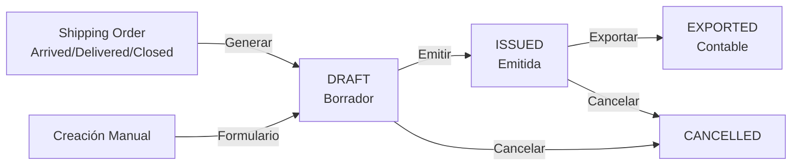

# Módulo de Pre-Facturación (Pre-Invoices)

## Descripción General

El módulo de Pre-Facturación permite generar facturas preliminares (proformas) a partir de las Órdenes de Envío (Shipping Orders) o de manera manual. Estas pre-facturas sirven como documentos de cobro antes de emitir la factura fiscal final.

## Flujo de Trabajo



## Estados de Pre-Factura

| Estado      | Descripción                                 |
| ----------- | ------------------------------------------- |
| `draft`     | Borrador - Puede ser modificada o cancelada |
| `issued`    | Emitida - Lista para cobro, no editable     |
| `cancelled` | Cancelada - Anulada, no afecta contabilidad |

---

## Formas de Creación

### 1. Desde Shipping Order (Automática)

Genera la pre-factura tomando todos los cargos de la orden.

**Requisitos:**

- Orden en estado `arrived`, `delivered`, o `closed`
- No debe existir otra pre-factura activa para esa orden

**Ubicación UI:** Botón **"Generar Pre-Factura"** en la vista de detalle del Shipping Order

### 2. Creación Manual

Permite crear pre-facturas independientes sin asociar a una orden.

**Ubicación UI:** Botón **"Nueva Pre-Factura"** en `/pre-invoices`

**Campos del formulario:**

- Cliente (obligatorio)
- Moneda (obligatorio)
- Fecha de emisión / vencimiento
- Referencia externa
- Notas internas
- Líneas de cargo dinámicas (código, descripción, cantidad, precio, impuesto)

---

## Estructura de Base de Datos

### Tabla: `pre_invoices`

| Campo               | Tipo          | Descripción                        |
| ------------------- | ------------- | ---------------------------------- |
| `id`                | bigint        | ID único                           |
| `number`            | string        | Número único (PI-YYYY-NNNNNN)      |
| `customer_id`       | FK            | Cliente facturado                  |
| `shipping_order_id` | FK (nullable) | Orden de envío origen              |
| `currency_code`     | string(3)     | Moneda (USD, DOP, etc.)            |
| `issue_date`        | date          | Fecha de emisión                   |
| `due_date`          | date          | Fecha de vencimiento               |
| `status`            | string        | Estado (draft, issued, cancelled)  |
| `subtotal_amount`   | decimal(18,4) | Subtotal sin impuestos             |
| `tax_amount`        | decimal(18,4) | Total impuestos                    |
| `total_amount`      | decimal(18,4) | Total final                        |
| `notes`             | text          | Notas internas                     |
| `external_ref`      | string        | Referencia externa                 |
| `exported_at`       | timestamp     | Fecha de exportación contable      |
| `export_reference`  | string        | Referencia del lote de exportación |

### Tabla: `pre_invoice_lines`

| Campo            | Tipo          | Descripción               |
| ---------------- | ------------- | ------------------------- |
| `id`             | bigint        | ID único                  |
| `pre_invoice_id` | FK            | Pre-factura padre         |
| `charge_id`      | FK (nullable) | Cargo origen (si aplica)  |
| `code`           | string(50)    | Código del concepto       |
| `description`    | string        | Descripción del cargo     |
| `qty`            | decimal(18,4) | Cantidad                  |
| `unit_price`     | decimal(18,4) | Precio unitario           |
| `amount`         | decimal(18,4) | Monto línea (qty × price) |
| `tax_amount`     | decimal(18,4) | Impuesto de la línea      |
| `currency_code`  | string(3)     | Moneda                    |
| `sort_order`     | int           | Orden de visualización    |

---

## API Endpoints

### Listado

```
GET /pre-invoices
```

Query params: `status`, `customer_id`

### Crear (Formulario)

```
GET /pre-invoices/create
```

### Guardar Nueva

```
POST /pre-invoices
```

Body:

```json
{
    "customer_id": 1,
    "currency_code": "USD",
    "issue_date": "2024-12-15",
    "due_date": "2025-01-14",
    "notes": "Notas opcionales",
    "external_ref": "REF-123",
    "lines": [
        {
            "code": "FRT",
            "description": "Flete Marítimo",
            "qty": 1,
            "unit_price": 1500.0,
            "tax_amount": 270.0
        }
    ]
}
```

### Detalle

```
GET /pre-invoices/{id}
```

### Imprimir PDF

```
GET /pre-invoices/{id}/print
```

### Emitir (Draft → Issued)

```
POST /pre-invoices/{id}/issue
```

### Cancelar

```
POST /pre-invoices/{id}/cancel
```

### Generar desde Shipping Order

```
POST /shipping-orders/{id}/pre-invoices
```

### Exportar a Sistema Contable

```
GET /pre-invoices-export
```

| Parámetro       | Tipo   | Default | Descripción               |
| --------------- | ------ | ------- | ------------------------- |
| `format`        | string | `csv`   | Formato: `csv` o `json`   |
| `date_from`     | date   | -       | Fecha inicio (issue_date) |
| `date_to`       | date   | -       | Fecha fin (issue_date)    |
| `customer_id`   | int    | -       | Filtrar por cliente       |
| `only_new`      | bool   | `false` | Solo no exportadas        |
| `mark_exported` | bool   | `true`  | Marcar como exportadas    |

---

## Servicios

### `PreInvoiceService`

Responsabilidades:

- Crear pre-facturas desde Shipping Orders
- Crear pre-facturas manuales
- Generar numeración secuencial (PI-YYYY-NNNNNN)
- Calcular totales incluyendo impuestos

```php
// Desde Shipping Order
$service->createFromShippingOrder($shippingOrder);

// Manual
$service->createManual([
    'customer_id' => 1,
    'currency_code' => 'USD',
    'issue_date' => '2024-12-15',
    'lines' => [...]
]);
```

### `PreInvoiceExportService`

Responsabilidades:

- Filtrar facturas exportables
- Generar formatos CSV/JSON
- Marcar como exportadas

### `PreInvoicePdfService`

Responsabilidades:

- Generar PDF de pre-factura
- Formato profesional con header/footer

---

## Permisos

| Permiso                 | Descripción                   |
| ----------------------- | ----------------------------- |
| `pre_invoices.view_any` | Ver listado de pre-facturas   |
| `pre_invoices.view`     | Ver detalle de pre-factura    |
| `pre_invoices.create`   | Crear nueva pre-factura       |
| `pre_invoices.update`   | Emitir o cancelar pre-factura |
| `pre_invoices.delete`   | Eliminar pre-factura          |

---

## Frontend

### Páginas

| Ruta                   | Componente   | Descripción                       |
| ---------------------- | ------------ | --------------------------------- |
| `/pre-invoices`        | `index.tsx`  | Listado con filtros y exportación |
| `/pre-invoices/create` | `create.tsx` | Formulario de creación manual     |
| `/pre-invoices/{id}`   | `show.tsx`   | Detalle con acciones              |

### Acciones Disponibles

| Acción              | Ubicación         | Descripción                         |
| ------------------- | ----------------- | ----------------------------------- |
| Nueva Pre-Factura   | Index             | Botón para crear pre-factura manual |
| Generar Pre-Factura | Shipping Order    | Botón para generar desde SO         |
| Ver Detalle         | Index / SO        | Link al detalle de la pre-factura   |
| Imprimir PDF        | Show              | Abrir PDF en nueva pestaña          |
| Emitir              | Show (solo draft) | Cambiar a estado issued             |
| Cancelar            | Show              | Marcar como cancelada               |
| Exportar CSV/JSON   | Index             | Descargar para sistema contable     |

### Integración con Shipping Order

En la vista de detalle del Shipping Order (`/shipping-orders/{id}`):

- **Botón "Generar Pre-Factura"**: Visible cuando la orden está en estado facturable y no tiene pre-factura activa
- **Link a Pre-Factura existente**: Si ya existe una pre-factura activa, muestra enlace directo

---

## Consideraciones Técnicas

### Prevención de Race Conditions

La generación de números usa `lockForUpdate()` para evitar duplicados:

```php
$last = PreInvoice::where('number', 'like', "{$prefix}%")
    ->lockForUpdate()
    ->orderBy('number', 'desc')
    ->first();
```

### Prevención de Duplicados

No se permite generar múltiples pre-facturas activas para la misma Shipping Order:

```php
if ($order->preInvoices()->where('status', '!=', 'cancelled')->exists()) {
    throw new InvalidArgumentException("Ya existe una Pre-Factura activa para esta orden.");
}
```

### Estados Válidos para Facturación desde SO

Solo se pueden generar pre-facturas de órdenes en:

- `arrived`
- `delivered`
- `closed`

---

## Datos de Prueba

```bash
php artisan db:seed --class=PreInvoiceSeeder
```

Crea 10 pre-facturas de prueba con diferentes estados y monedas.

---

## Archivos del Módulo

```
app/
├── Http/Controllers/
│   └── PreInvoiceController.php
├── Models/
│   ├── PreInvoice.php
│   └── PreInvoiceLine.php
├── Policies/
│   └── PreInvoicePolicy.php
└── Services/
    ├── PreInvoiceService.php
    ├── PreInvoiceExportService.php
    └── PreInvoicePdfService.php

resources/
├── js/pages/billing/pre-invoices/
│   ├── index.tsx
│   ├── create.tsx
│   └── show.tsx
└── views/pdf/
    └── pre-invoice.blade.php

database/
├── migrations/
│   ├── 2025_12_15_180047_create_core_billing_tables.php
│   └── 2025_12_15_212359_add_export_fields_to_pre_invoices_table.php
└── seeders/
    └── PreInvoiceSeeder.php
```

---

## Integración con QuickBooks (Futuro)

El formato de exportación está diseñado para ser compatible con QuickBooks:

1. El campo `customer_code` mapea al Customer ID en QB
2. Los códigos de cargo (`FRT`, `THC`, etc.) mapean a Items/Services en QB
3. El formato de fecha es ISO 8601
