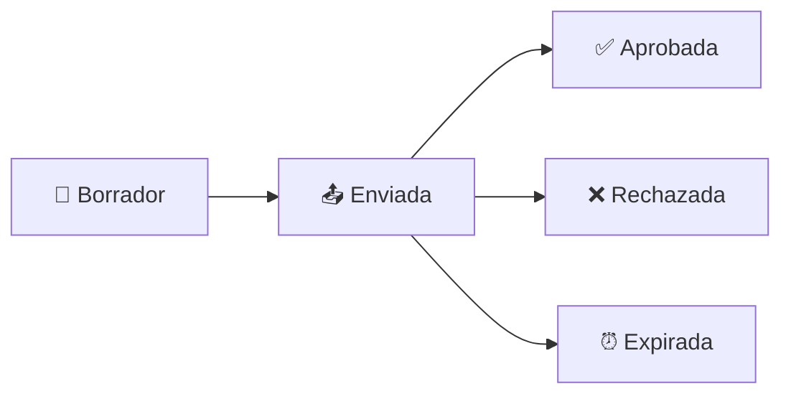
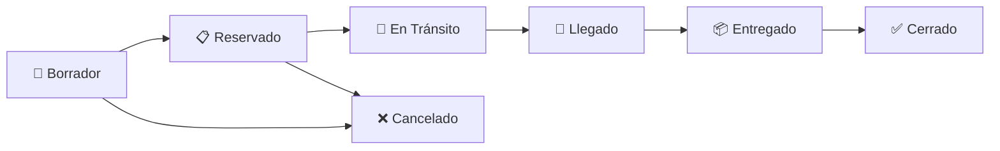
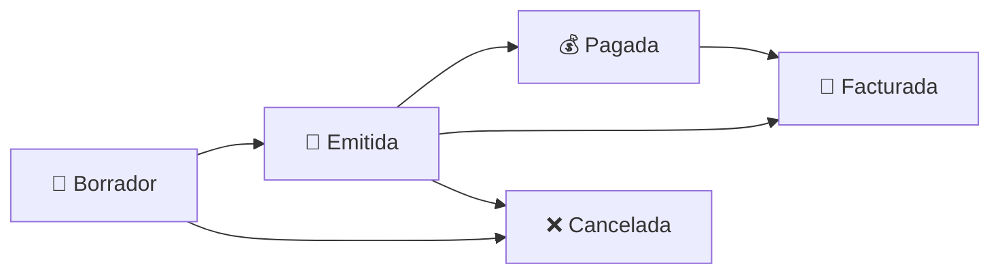

# Manual de Usuario - Sistema de Facturación y Logística

## MAED Logistic Platform

---

## Tabla de Contenidos

1. [Cotizaciones (Quotes)](#1-cotizaciones-quotes)
2. [Órdenes de Envío (Shipping Orders)](#2-órdenes-de-envío-shipping-orders)
3. [Pre-Facturas](#3-pre-facturas)
4. [Facturas Fiscales](#4-facturas-fiscales)
5. [Reportes DGII](#5-reportes-dgii)

---

## 1. Cotizaciones (Quotes)

### ¿Qué es una Cotización?

Una cotización es un documento comercial que presenta al cliente una propuesta de precios para servicios logísticos. Es el primer paso en el flujo de ventas del sistema.

### Acceder al Módulo

1. En el menú lateral, haga clic en **"Ventas"**
2. Seleccione **"Cotizaciones"**

### Crear una Nueva Cotización

1. Haga clic en el botón **"+ Nueva Cotización"**
2. Complete los campos del encabezado:

    | Campo              | Descripción                          | Obligatorio  |
    | ------------------ | ------------------------------------ | ------------ |
    | Cliente            | Seleccione el cliente de la lista    | ✅ Sí       |      	
    | Puerto Origen      | Puerto de salida de la mercancía     | ✅ Sí      | 
    | Puerto Destino     | Puerto de llegada de la mercancía    | ✅ Sí      | 
    | Modo de Transporte | Aéreo, Marítimo o Terrestre          | ✅ Sí      | 
    | Tipo de Servicio   | FCL, LCL, Express, etc.              | ✅ Sí      | 
    | Moneda             | USD, DOP, EUR, etc.                  | ✅ Sí      |
    | Fecha de Validez   | Hasta cuándo es válida la cotización | Opcional    |
    | Términos de Pago   | Condiciones de pago acordadas        | Opcional    |
    | Notas              | Observaciones adicionales            | Opcional    |

3. **Agregar Líneas de Productos/Servicios**:
    - Haga clic en **"+ Agregar Línea"**
    - Seleccione el producto o servicio del catálogo
    - Ingrese:
        - Cantidad
        - Precio unitario
        - Descuento (%) - opcional
        - Impuesto (%) - generalmente 18% ITBIS

4. Haga clic en **"Guardar"** para crear la cotización en estado Borrador

### Estados de una Cotización

| Estado        | Descripción                                       | Acciones Disponibles                      |
| ------------- | ------------------------------------------------- | ----------------------------------------- |
| **Borrador**  | Cotización en edición, no visible para el cliente | Editar, Enviar, Eliminar                  |
| **Enviada**   | Enviada al cliente, pendiente de respuesta        | Marcar Aprobada, Marcar Rechazada         |
| **Aprobada**  | El cliente aceptó la cotización                   | Convertir a Orden de Envío, Ver, Imprimir |
| **Rechazada** | El cliente rechazó la cotización                  | Ver, Imprimir                             |
| **Expirada**  | Pasó la fecha de validez sin respuesta            | Ver, Imprimir                             |

### Flujo de Trabajo de una Cotización

#### Paso 1: Enviar al Cliente

1. Abra la cotización en estado **Borrador**
2. Haga clic en el botón **"Enviar"**
3. El sistema cambiará el estado a **Enviada**

#### Paso 2: Registrar Respuesta del Cliente

- Si el cliente **acepta**: Haga clic en **"Marcar como Aprobada"**
- Si el cliente **rechaza**: Haga clic en **"Marcar como Rechazada"**

#### Paso 3: Convertir a Orden de Envío

1. Desde una cotización **Aprobada**, haga clic en **"Convertir a Orden de Envío"**
2. El sistema creará automáticamente una Orden de Envío con todos los datos de la cotización
3. Será redirigido a la nueva Orden de Envío

### Imprimir/Descargar PDF

1. Haga clic en el ícono de impresora 🖨️
2. Se descargará un PDF con formato profesional
3. El PDF incluye:
    - Logo de la empresa
    - Datos del cliente
    - Detalle de líneas
    - Subtotal, impuestos y total
    - Términos y condiciones

---

## 2. Órdenes de Envío (Shipping Orders)

### ¿Qué es una Orden de Envío?

Una Orden de Envío representa un embarque logístico completo, desde que se reserva hasta que se entrega al cliente final. Es el documento central del sistema de logística.

### Acceder al Módulo

1. En el menú lateral, haga clic en **"Operaciones"**
2. Seleccione **"Órdenes de Envío"**

### Crear una Nueva Orden de Envío

Existen dos formas de crear una Orden de Envío:

#### Opción A: Desde una Cotización Aprobada (Recomendado)

1. Vaya a la cotización aprobada
2. Haga clic en **"Convertir a Orden de Envío"**
3. La orden se creará con todos los datos precargados

#### Opción B: Creación Manual

1. Haga clic en **"+ Nueva Orden"**
2. Complete los campos del formulario:

    **Información General:**
    | Campo | Descripción |
    |-------|-------------|
    | Cliente | Cliente destinatario del servicio |
    | Embarcador (Shipper) | Quien envía la mercancía |
    | Consignatario | Quien recibe la mercancía |
    | Puerto Origen | País/puerto de salida |
    | Puerto Destino | País/puerto de llegada |
    | Modo de Transporte | Marítimo, Aéreo, Terrestre |
    | Tipo de Servicio | FCL, LCL, Express, etc. |

    **Detalles del Embarque (según modo de transporte):**

    _Para Marítimo:_
    | Campo | Descripción |
    |-------|-------------|
    | MBL | Master Bill of Lading |
    | HBL | House Bill of Lading |
    | Naviera | Nombre de la línea naviera |
    | Buque | Nombre del barco |
    | Viaje | Número de viaje |
    | Contenedores | Detalle de contenedores |

    _Para Aéreo:_
    | Campo | Descripción |
    |-------|-------------|
    | MAWB | Master Air Waybill |
    | HAWB | House Air Waybill |
    | Aerolínea | Nombre de la aerolínea |
    | Vuelo | Número de vuelo |

3. Haga clic en **"Guardar"**

### Estados de una Orden de Envío

| Estado          | Descripción                             | Siguiente Paso     |
| --------------- | --------------------------------------- | ------------------ |
| **Borrador**    | Orden en preparación                    | → Reservar         |
| **Reservado**   | Espacio confirmado con el transportista | → Iniciar Tránsito |
| **En Tránsito** | Mercancía en camino                     | → Marcar Llegada   |
| **Llegado**     | Llegó al puerto/aeropuerto destino      | → Marcar Entregado |
| **Entregado**   | Entregado al cliente final              | → Cerrar Orden     |
| **Cerrado**     | Orden completada y cerrada              | (Estado final)     |
| **Cancelado**   | Orden cancelada                         | (Estado final)     |

### Transiciones de Estado

Para cambiar el estado de una orden:

1. Abra la orden
2. En la parte superior verá los botones de acción disponibles según el estado actual:
    - **"Reservar"** - Confirma la reserva con el transportista
    - **"Iniciar Tránsito"** - Indica que la mercancía partió
    - **"Marcar Llegada"** - Indica que llegó al destino
    - **"Marcar Entregado"** - Indica entrega al cliente
    - **"Cerrar"** - Cierra la orden
    - **"Cancelar"** - Cancela la orden (requiere motivo)

### Gestión de Hitos (Milestones)

Los hitos permiten registrar eventos importantes durante el embarque:

1. En la página de la orden, busque la sección **"Hitos"**
2. Haga clic en **"+ Agregar Hito"**
3. Complete:
    - **Código**: Tipo de evento (Booking, Departure, Arrival, etc.)
    - **Fecha/Hora**: Cuándo ocurrió
    - **Ubicación**: Dónde ocurrió (opcional)
    - **Observaciones**: Notas adicionales (opcional)

### Gestión de Documentos

Para adjuntar documentos a la orden:

1. En la sección **"Documentos"**
2. Haga clic en **"+ Subir Documento"**
3. Seleccione el tipo de documento:
    - Bill of Lading
    - Air Waybill
    - Factura Comercial
    - Packing List
    - Certificado de Origen
    - Otros
4. Seleccione el archivo (máx. 10MB)
5. Haga clic en **"Subir"**

### Cargos y Costos

Para agregar cargos al embarque:

1. En la sección **"Cargos"**
2. Haga clic en **"+ Agregar Cargo"**
3. Complete:
    - **Servicio**: Seleccione del catálogo o ingrese nuevo
    - **Tipo**: Flete, Recargo, Impuesto, Otro
    - **Base**: Monto fijo, Por Kg, Por CBM, Por envío
    - **Cantidad**
    - **Precio Unitario**
    - **Moneda**

### Enlace de Tracking Público

Para compartir el tracking con el cliente:

1. Haga clic en **"Habilitar Tracking Público"**
2. Se generará un enlace único
3. Copie el enlace y compártalo con el cliente
4. El cliente podrá ver el estado y los hitos sin necesidad de iniciar sesión

---

## 3. Pre-Facturas

### ¿Qué es una Pre-Factura?

Una Pre-Factura es un documento comercial previo a la factura fiscal. Se utiliza para cobrar al cliente antes de emitir el comprobante fiscal.

### Acceder al Módulo

1. En el menú lateral, haga clic en **"Facturación"**
2. Seleccione **"Pre-Facturas"**

### Crear una Pre-Factura

#### Opción A: Desde una Orden de Envío (Recomendado)

1. Abra una Orden de Envío en estado **Llegado**, **Entregado** o **Cerrado**
2. Haga clic en **"Generar Pre-Factura"**
3. El sistema creará la pre-factura con los cargos de la orden

#### Opción B: Creación Manual

1. Haga clic en **"+ Nueva Pre-Factura"**
2. Complete los campos:
    - Cliente
    - Fecha de emisión
    - Fecha de vencimiento
    - Moneda
    - Notas (opcional)
3. Agregue las líneas de productos/servicios
4. Haga clic en **"Guardar"**

### Estados de una Pre-Factura

| Estado        | Descripción                           | Acciones                                      |
| ------------- | ------------------------------------- | --------------------------------------------- |
| **Borrador**  | En edición                            | Editar, Emitir, Cancelar                      |
| **Emitida**   | Enviada al cliente, pendiente de pago | Registrar Pago, Convertir a Factura, Cancelar |
| **Pagada**    | Completamente pagada                  | Convertir a Factura, Ver                      |
| **Cancelada** | Anulada                               | Ver                                           |

### Flujo de Trabajo

### Registrar Pagos

1. Abra la pre-factura emitida
2. En la sección **"Pagos"**, haga clic en **"+ Registrar Pago"**
3. Complete:
    - Monto
    - Fecha de pago
    - Método (Efectivo, Transferencia, Cheque, Tarjeta)
    - Referencia (opcional)
4. Haga clic en **"Guardar"**

El sistema actualizará automáticamente el balance pendiente.

### Convertir a Factura Fiscal

1. Desde una pre-factura **Emitida** o **Pagada**
2. Haga clic en **"Emitir Factura Fiscal"**
3. Seleccione el tipo de comprobante fiscal (NCF):
    - **01** - Factura de Crédito Fiscal
    - **02** - Factura de Consumo
    - **14** - Régimen Especial
    - **15** - Gubernamental
4. Confirme la operación
5. El sistema:
    - Asignará automáticamente el NCF disponible
    - Creará la factura fiscal
    - Marcará la pre-factura como facturada

---

## 4. Facturas Fiscales

### ¿Qué es una Factura Fiscal?

Una Factura Fiscal es el comprobante oficial con validez tributaria ante la DGII (Dirección General de Impuestos Internos). Incluye el NCF (Número de Comprobante Fiscal) obligatorio en República Dominicana.

### Acceder al Módulo

1. En el menú lateral, haga clic en **"Facturación"**
2. Seleccione **"Facturas Fiscales"**

### Tipos de NCF Soportados

| Código | Tipo             | Uso                                                   |
| ------ | ---------------- | ----------------------------------------------------- |
| **01** | Crédito Fiscal   | Para clientes con RNC que pueden deducir ITBIS        |
| **02** | Consumo          | Para consumidores finales sin RNC                     |
| **14** | Régimen Especial | Para empresas en zonas francas y regímenes especiales |
| **15** | Gubernamental    | Para entidades del gobierno                           |

### Crear una Factura Fiscal

Las facturas fiscales se crean únicamente desde Pre-Facturas para garantizar la trazabilidad:

1. Vaya a la pre-factura que desea facturar
2. Haga clic en **"Emitir Factura Fiscal"**
3. El sistema mostrará el siguiente NCF disponible
4. Confirme la emisión

> **⚠️ Importante**: Una vez emitida, la factura fiscal NO puede ser editada. Solo puede ser anulada.

### Estados de una Factura

| Estado      | Descripción                         |
| ----------- | ----------------------------------- |
| **Emitida** | Factura válida y activa             |
| **Anulada** | Factura cancelada (requiere motivo) |

### Anular una Factura

Solo debe anular una factura por razones válidas:

1. Abra la factura
2. Haga clic en **"Anular Factura"**
3. Ingrese el motivo de la anulación (obligatorio)
4. Confirme

> **Nota**: Las facturas anuladas aparecen en el reporte 608 de la DGII.

### Información de la Factura

Cada factura incluye:

| Campo                 | Descripción                                       |
| --------------------- | ------------------------------------------------- |
| **Número Interno**    | INV-YYYY-NNNNNN (generado automáticamente)        |
| **NCF**               | Comprobante fiscal (ej: B0100000123)              |
| **Tipo NCF**          | 01, 02, 14, 15                                    |
| **Cliente**           | Datos del cliente (RNC/Cédula, nombre, dirección) |
| **Fecha Emisión**     | Fecha de la factura                               |
| **Fecha Vencimiento** | Fecha límite de pago                              |
| **Subtotal**          | Monto antes de impuestos                          |
| **ITBIS**             | Impuesto (18%)                                    |
| **Total**             | Monto total a pagar                               |

### Descargar PDF

1. Haga clic en el ícono de impresora 🖨️
2. Se descargará el PDF con formato fiscal que incluye:
    - Número de factura y NCF
    - Datos fiscales del emisor (RNC, dirección)
    - Datos fiscales del cliente
    - Detalle de líneas con ITBIS
    - Totales desglosados

---

## 5. Reportes DGII

### ¿Qué son los Reportes DGII?

Los reportes 607 y 608 son declaraciones mensuales obligatorias ante la DGII:

- **607**: Reporte de Ingresos (ventas/facturas emitidas)
- **608**: Reporte de Anulaciones (facturas anuladas)

### Acceder a los Reportes

1. En el menú lateral, haga clic en **"Facturación"**
2. Seleccione **"Reportes DGII"**

### Generar Reporte 607 (Ingresos)

1. Seleccione el **Año** y **Mes** a reportar
2. Haga clic en **"Generar 607"**
3. El sistema:
    - Buscará todas las facturas emitidas en ese período
    - Generará el archivo TXT en formato DGII
    - Iniciará la descarga automática

El archivo incluye por cada factura:

- RNC/Cédula del cliente
- Tipo de identificación
- NCF
- NCF modificado (si aplica)
- Fecha del comprobante
- Fecha de pago/retención
- Monto facturado
- ITBIS facturado
- ITBIS retenido
- ITBIS sujeto a proporcionalidad
- Retención de renta
- ISR percibido
- ISC
- Otros impuestos/tasas
- Monto propina legal
- Forma de pago

### Generar Reporte 608 (Anulaciones)

1. Seleccione el **Año** y **Mes** a reportar
2. Haga clic en **"Generar 608"**
3. El sistema generará el archivo TXT con las facturas anuladas

El archivo incluye:

- RNC del emisor
- NCF anulado
- Tipo de anulación
- Fecha de anulación

### Estadísticas del Período

La página de reportes muestra resúmenes del período seleccionado:

| Métrica           | Descripción                   |
| ----------------- | ----------------------------- |
| Total Facturas    | Cantidad de facturas emitidas |
| Monto Total       | Suma de todas las facturas    |
| ITBIS Total       | Suma del ITBIS cobrado        |
| Facturas Anuladas | Cantidad de anulaciones       |

### Historial de Exportaciones

El sistema mantiene un registro de todas las exportaciones realizadas:

- Fecha de generación
- Período reportado
- Usuario que generó
- Tipo de reporte (607/608)

---

## Preguntas Frecuentes

### ¿Puedo editar una cotización después de enviarla?

No, una vez enviada no puede editarse. Debe crear una nueva cotización.

### ¿Qué pasa si una cotización expira?

Si pasa la fecha de validez y no hay respuesta, el sistema la marca automáticamente como Expirada.

### ¿Puedo generar una factura sin pre-factura?

No, el flujo requiere pasar por una pre-factura para garantizar trazabilidad.

### ¿Puedo anular una factura de meses anteriores?

Sí, pero debe considerar las implicaciones fiscales. Consulte con su contador.

### ¿Los reportes DGII se envían automáticamente?

No, debe descargar los archivos TXT y subirlos manualmente a la Virtual Office de la DGII.

### ¿Qué hago si me quedo sin NCF disponibles?

Debe solicitar más NCF en la Virtual Office de la DGII y agregarlos en **Configuración > Secuencias Fiscales**.

---

## Glosario

| Término      | Definición                                                                     |
| ------------ | ------------------------------------------------------------------------------ |
| **NCF**      | Número de Comprobante Fiscal - Identificador único de cada factura             |
| **ITBIS**    | Impuesto a la Transferencia de Bienes Industrializados y Servicios (18%)       |
| **RNC**      | Registro Nacional del Contribuyente                                            |
| **DGII**     | Dirección General de Impuestos Internos                                        |
| **MBL/MAWB** | Master Bill of Lading / Master Air Waybill - Documento principal de transporte |
| **HBL/HAWB** | House Bill of Lading / House Air Waybill - Documento del agente de carga       |
| **FCL**      | Full Container Load - Contenedor completo                                      |
| **LCL**      | Less than Container Load - Carga consolidada                                   |
| **POD**      | Proof of Delivery - Prueba de entrega                                          |

---

_Última actualización: Diciembre 2025_
_Versión del documento: 1.0_
