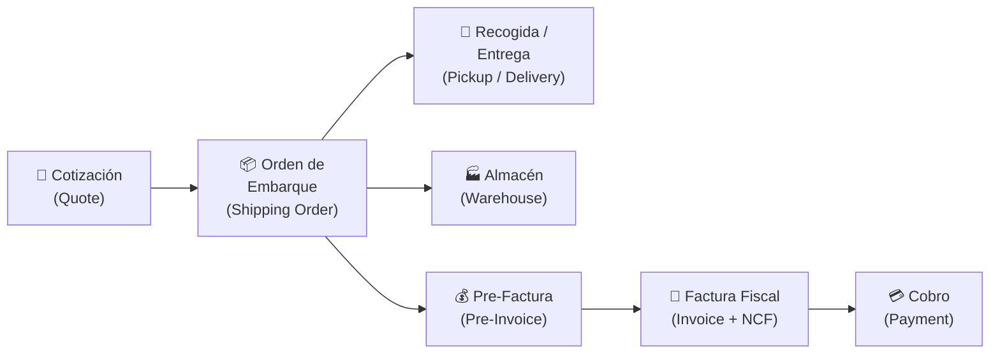
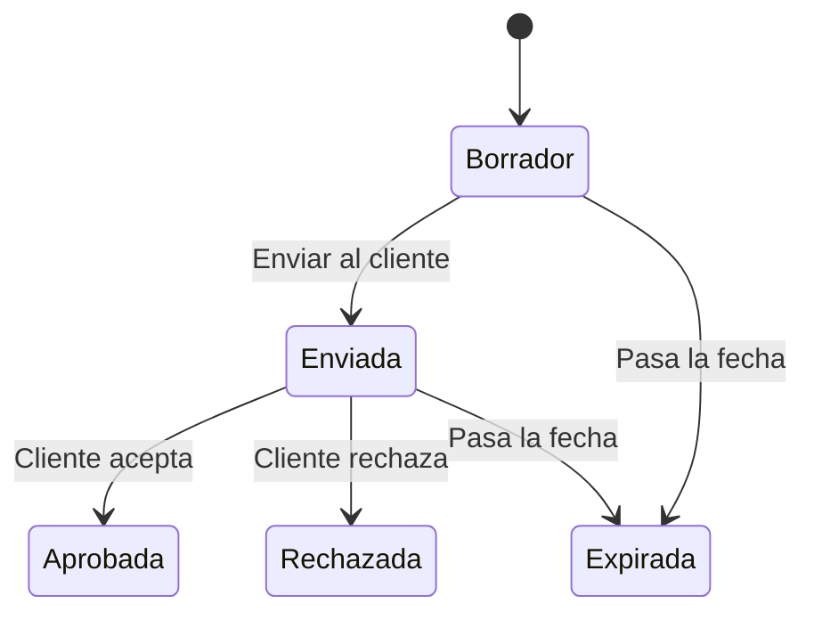
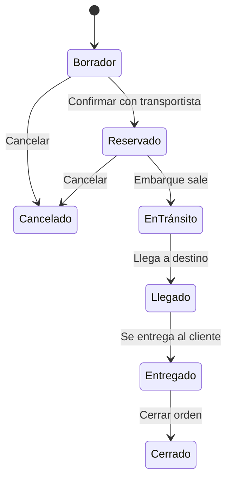
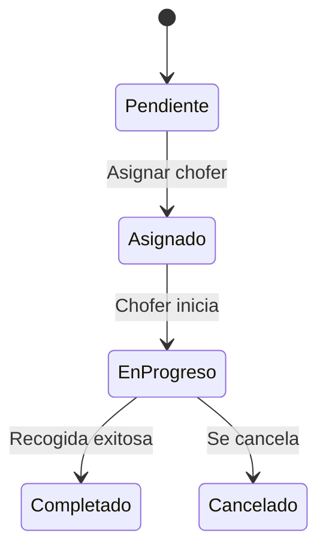
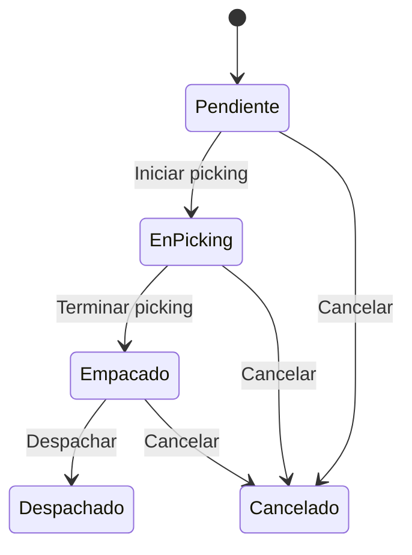
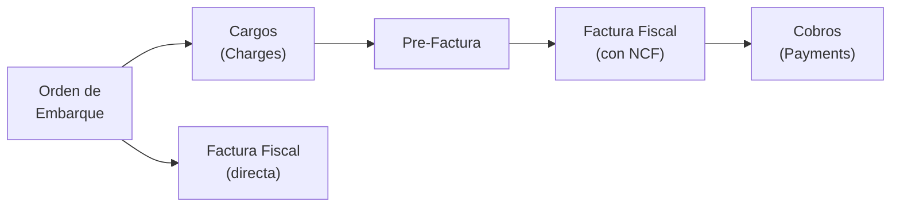
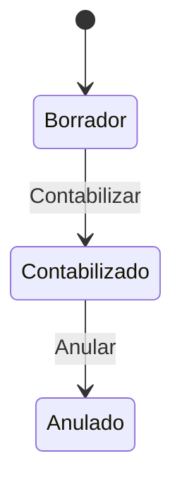
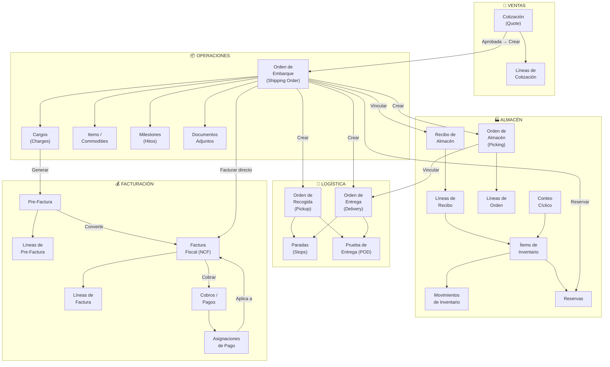
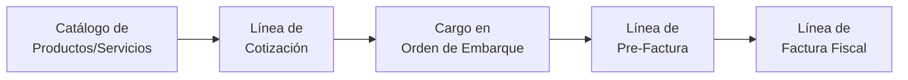

# 📦 Documentación de Flujos de Negocio — MAED Logistic Platform

> Guía completa para usuarios no técnicos sobre los procesos de ventas, compras, inventario, logística y facturación.

---

## 📑 Tabla de Contenido

1. [Visión General del Sistema](#1-visión-general-del-sistema)
2. [Flujo de Ventas (Cotizaciones)](#2-flujo-de-ventas-cotizaciones)
3. [Flujo de Órdenes de Embarque (Shipping Orders)](#3-flujo-de-órdenes-de-embarque)
4. [Flujo de Logística: Recogida y Entrega](#4-flujo-de-logística-recogida-y-entrega)
5. [Flujo de Inventario (Almacén)](#5-flujo-de-inventario-almacén)
6. [Flujo de Facturación](#6-flujo-de-facturación)
7. [Flujo de Cobros y Pagos](#7-flujo-de-cobros-y-pagos)
8. [Mapa de Dependencias entre Documentos](#8-mapa-de-dependencias-entre-documentos)
9. [Módulos de Facturación: Inventario vs. Productos/Servicios](#9-módulos-de-facturación)
10. [Resumen de Informaciones Obligatorias por Documento](#10-resumen-de-informaciones-obligatorias)

---

## 1. Visión General del Sistema

MAED Logistic Platform es un sistema integral de gestión logística que cubre desde la cotización de un servicio hasta el cobro final al cliente. El flujo general sigue esta secuencia:

---

## 2. Flujo de Ventas (Cotizaciones)

### ¿Qué es una Cotización (Quote)?
Es una oferta de precio que se le envía al cliente por un servicio logístico (transporte marítimo, aéreo, terrestre, almacenaje, etc.). Es el **primer documento** del flujo y de ella se originan todos los demás.

### Estados de una Cotización

| Estado | Significado | ¿Qué puede hacer el usuario? |
|--------|-------------|------------------------------|
| **Borrador** (Draft) | Se está preparando, aún no se ha enviado al cliente | Editar, agregar líneas, enviar |
| **Enviada** (Sent) | Ya fue enviada al cliente para su revisión | Aprobar o rechazar |
| **Aprobada** (Approved) | El cliente aceptó la cotización | Convertir en Orden de Embarque |
| **Rechazada** (Rejected) | El cliente no aceptó (estado final) | Solo consultar |
| **Expirada** (Expired) | Pasó la fecha de validez sin respuesta (estado final) | Solo consultar |

### Transiciones permitidas

### Informaciones Obligatorias

| Campo | Descripción | ¿Obligatorio? |
|-------|-------------|:---:|
| Cliente | A quién va dirigida la cotización | ✅ Sí |
| Contacto | Persona de contacto del cliente | ✅ Sí |
| Modo de Transporte | Marítimo, aéreo, terrestre | ✅ Sí |
| Tipo de Servicio | Tipo de servicio logístico | ✅ Sí |
| Puerto de Origen | De dónde sale la mercancía | ✅ Sí |
| Puerto de Destino | A dónde llega la mercancía | ✅ Sí |
| Moneda | Moneda de la cotización (USD, DOP, etc.) | ✅ Sí |
| Fecha de Validez | Hasta cuándo es válida la oferta | ✅ Sí |
| Líneas de Cotización | Productos/servicios con cantidad, precio, impuesto | ✅ Mín. 1 línea |
| Representante de Ventas | Vendedor responsable | Recomendado |
| División / Proyecto | Unidad de negocio | Opcional |
| Términos de Pago | Condiciones de pago del cliente | Opcional |

### Documentos que dependen de la Cotización
- **Orden de Embarque (Shipping Order)**: Se crea *a partir* de una cotización aprobada
- **Cargos (Charges)**: Los cargos de la cotización se copian a la Orden de Embarque

---

## 3. Flujo de Órdenes de Embarque

### ¿Qué es una Orden de Embarque (Shipping Order)?
Es el documento operativo central del sistema. Representa un envío real de mercancía y se crea a partir de una cotización aprobada o manualmente. De esta orden se generan todos los documentos logísticos y de facturación.

### Estados de una Orden de Embarque

| Estado | Significado |
|--------|------------|
| **Borrador** (Draft) | Se está preparando la orden |
| **Reservado** (Booked) | Transportista confirmado, embarque programado |
| **En Tránsito** (In Transit) | La mercancía partió del origen |
| **Llegado** (Arrived) | Llegó al puerto/almacén de destino |
| **Entregado** (Delivered) | Entregada al destinatario final |
| **Cerrado** (Closed) | Completado y cerrado (estado final) |
| **Cancelado** (Cancelled) | Cancelado (estado final) |

### Transiciones permitidas

### Informaciones Obligatorias

| Campo | Descripción | ¿Obligatorio? |
|-------|-------------|:---:|
| Número de Orden | Generado automáticamente (SO-YYYY-NNNNNN) | ✅ Automático |
| Cliente | Cliente dueño de la carga | ✅ Sí |
| Modo de Transporte | Marítimo, aéreo, terrestre | ✅ Sí |
| Tipo de Servicio | Tipo de servicio logístico | ✅ Sí |
| Puerto de Origen | Puerto o lugar de origen | ✅ Sí |
| Puerto de Destino | Puerto o lugar de destino | ✅ Sí |
| Moneda | Moneda de la operación | ✅ Sí |
| Shipper (Remitente) | Quién envía la mercancía | Recomendado |
| Consignee (Consignatario) | Quién recibe la mercancía | Recomendado |
| Items/Commodities | Detalle de la mercancía transportada | Recomendado |

### Documentos que dependen de la Orden de Embarque

| Documento | Relación |
|-----------|----------|
| Cotización (Quote) | La orden **proviene** de una cotización |
| Órdenes de Recogida (Pickup Orders) | Se crean **desde** la orden de embarque |
| Órdenes de Entrega (Delivery Orders) | Se crean **desde** la orden de embarque |
| Cargos (Charges) | Se asocian **a** la orden de embarque |
| Recibos de Almacén (Warehouse Receipts) | Se pueden vincular **a** la orden |
| Reservas de Inventario | Se hacen **contra** la orden |
| Órdenes de Almacén (Warehouse Orders) | Se generan **desde** la orden |
| Pre-Facturas | Se generan **desde** la orden y sus cargos |
| Facturas Fiscales | Se generan **desde** la orden o sus pre-facturas |
| Milestones (Hitos) | Registran eventos de seguimiento de la orden |
| Documentos adjuntos | BL, factura comercial, packing list, etc. |

---

## 4. Flujo de Logística: Recogida y Entrega

### 4.1 Orden de Recogida (Pickup Order)

Es la orden para que un chofer recoja la mercancía en la ubicación del shipper (remitente).

**Estados:**

| Estado | Significado |
|--------|------------|
| **Pendiente** | Creada, sin chofer asignado |
| **Asignado** | Chofer asignado |
| **En Progreso** | Chofer en camino o recogiendo |
| **Completado** | Recogida finalizada (estado final) |
| **Cancelado** | Cancelada (estado final) |

**Informaciones obligatorias:**
- Orden de Embarque vinculada
- Cliente
- Fecha programada de recogida
- Chofer asignado (al pasar a estado "Asignado")

**Documentos relacionados:**
- **Paradas (Stops)**: Puntos de recogida con secuencia
- **POD (Proof of Delivery)**: Prueba de recogida con firma/foto

### 4.2 Orden de Entrega (Delivery Order)

Es la orden para que un chofer entregue la mercancía al consignatario.

**Estados:** Idénticos a la Orden de Recogida (Pendiente → Asignado → En Progreso → Completado/Cancelado).

**Informaciones obligatorias:**
- Orden de Embarque vinculada
- Cliente
- Fecha programada de entrega
- Chofer asignado

**Documentos relacionados:**
- **Paradas (Stops)**: Puntos de entrega con secuencia
- **POD (Proof of Delivery)**: Prueba de entrega con firma/foto

### 4.3 Proceso de Picking (Preparación de Pedidos)

La **Orden de Almacén (Warehouse Order)** gestiona la preparación física de un pedido dentro del almacén. Conecta la Orden de Embarque con las operaciones físicas de picking, empaque y despacho.

**Estados de la Orden de Almacén:**

| Estado | Significado |
|--------|------------|
| **Pendiente** | Creada, esperando inicio |
| **En Picking** | El operario está buscando los ítems en el almacén |
| **Empacado** | Todos los ítems fueron recolectados y empacados |
| **Despachado** | La mercancía fue despachada (estado final) |
| **Cancelado** | Orden cancelada (estado final) |

**Informaciones obligatorias:**
- Almacén donde se procesa
- Orden de Embarque vinculada
- Líneas con ítems a recolectar (cantidad a pickear y cantidad pickeada)

**Documentos relacionados:**
- **Líneas de Orden de Almacén**: Cada línea indica un ítem de inventario, la cantidad a pickear y la cantidad efectivamente pickeada
- **Orden de Entrega**: Se puede vincular para coordinar el despacho

---

## 5. Flujo de Inventario (Almacén)

### 5.1 Recepción de Mercancía (Warehouse Receipt)

Cuando llega mercancía al almacén, se crea un **Recibo de Almacén** que registra qué se recibió.

**Estados:**

| Estado | Significado |
|--------|------------|
| **Borrador** (Draft) | Se está preparando el recibo |
| **Recibido** (Received) | Mercancía físicamente recibida, ítems de inventario creados |
| **Cerrado** (Closed) | Proceso completado (estado final) |
| **Cancelado** (Cancelled) | Recibo anulado (estado final) |

**Informaciones obligatorias:**
- Almacén de destino
- Cliente (dueño de la mercancía)
- Número de recibo (generado automáticamente)
- Líneas del recibo (descripción, cantidad, unidad de medida, código de ítem)

**Documentos que se generan:**
- **Ítems de Inventario**: Se crean automáticamente al confirmar la recepción

### 5.2 Ítems de Inventario (Inventory Items)

Cada **ítem de inventario** representa un artículo físico almacenado. Se crea a partir de un recibo de almacén.

**Informaciones que contiene:**
- Almacén y ubicación física (pasillo, estante, nivel)
- Código de ítem y descripción
- Cantidad disponible
- Número de lote y/o número de serie
- Fecha de vencimiento (si aplica)
- Cliente dueño de la mercancía
- Recibo de almacén de origen

### 5.3 Movimientos de Inventario

Cada vez que un ítem de inventario cambia, se registra un **movimiento**:

| Tipo de Movimiento | Descripción |
|--------------------|-------------|
| **Recepción** (Receive) | Ingreso de mercancía al almacén |
| **Ubicación** (Putaway) | Colocación del ítem en su ubicación física |
| **Picking** | Extracción del ítem para preparar un pedido |
| **Transferencia** (Transfer) | Mover un ítem de una ubicación a otra |
| **Ajuste** (Adjust) | Corrección de cantidades por conteo o error |
| **Devolución** (Return) | La mercancía regresa al almacén |
| **Reserva** (Reserve) | Se aparta cantidad para una orden de embarque |
| **Liberación** (Release) | Se libera una reserva previamente hecha |

### 5.4 Reservas de Inventario

Las **reservas** permiten apartar una cantidad de un ítem de inventario para una Orden de Embarque específica antes de que se haga el picking físico.

> [!IMPORTANT]
> Solo se puede reservar inventario en órdenes con estado **Reservado** o **En Tránsito**.

### 5.5 Conteo Cíclico (Cycle Count)

Proceso para verificar las cantidades físicas vs. las del sistema.

**Estados:** Borrador → En Progreso → Completado/Cancelado

**Informaciones obligatorias:**
- Almacén a contar
- Líneas con ítems (cantidad del sistema, cantidad contada, diferencia)

---

## 6. Flujo de Facturación

### 6.1 Pre-Factura (Pre-Invoice)

La pre-factura es un documento **interno** que se genera a partir de los cargos de una Orden de Embarque. Sirve como paso previo a la factura fiscal.

**Estados:**

| Estado | Significado |
|--------|------------|
| **Borrador** (Draft) | Se está preparando |
| **Emitida** (Issued) | Lista para cobro — puede recibir pagos |
| **Pagada** (Paid) | Totalmente pagada (estado final) |
| **Cancelada** (Cancelled) | Anulada (estado final) |

**Informaciones obligatorias:**

| Campo | Descripción | ¿Obligatorio? |
|-------|-------------|:---:|
| Número | Generado automáticamente | ✅ Automático |
| Cliente | A quién se factura | ✅ Sí |
| Orden de Embarque | Orden de la que provienen los cargos | ✅ Sí |
| Moneda | Moneda de facturación | ✅ Sí |
| Fecha de emisión | Cuándo se emitió | ✅ Sí |
| Fecha de vencimiento | Cuándo debe pagarse | ✅ Sí |
| Líneas | Detalle de servicios / cargos | ✅ Mín. 1 línea |

**Cada línea de pre-factura contiene:**
- Código y descripción del cargo
- Cantidad y precio unitario
- Monto, tasa de impuesto e impuesto calculado
- Referencia al cargo original de la Orden de Embarque

### 6.2 Factura Fiscal (Invoice)

La factura fiscal es el documento legal con **NCF** (Número de Comprobante Fiscal) requerido por la DGII. Se genera a partir de una pre-factura o directamente desde una Orden de Embarque.

**Estados:**

| Estado | Significado |
|--------|------------|
| **Emitida** (Issued) | Factura vigente, puede recibir pagos |
| **Cancelada** (Cancelled) | Factura anulada (estado final) |

**Informaciones obligatorias:**

| Campo | Descripción | ¿Obligatorio? |
|-------|-------------|:---:|
| Número de Factura | Generado automáticamente (INV-YYYY-NNNNNN) | ✅ Automático |
| NCF | Comprobante fiscal (de la secuencia fiscal) | ✅ Sí |
| Tipo de NCF | B01 (Fiscal), B02 (Consumidor), etc. | ✅ Sí |
| Cliente | A quién se factura | ✅ Sí |
| Fecha de emisión | Fecha del documento fiscal | ✅ Sí |
| Fecha de vencimiento | Fecha límite de pago | ✅ Sí |
| Moneda | Moneda de la factura | ✅ Sí |
| Subtotal | Monto antes de impuestos | ✅ Calculado |
| Monto gravado | Monto sujeto a impuestos | ✅ Calculado |
| Monto exento | Monto no sujeto a impuestos | ✅ Calculado |
| ITBIS | Monto del impuesto | ✅ Calculado |
| Total | Monto total a pagar | ✅ Calculado |
| Líneas de factura | Detalle de productos/servicios facturados | ✅ Mín. 1 línea |

**Secuencias Fiscales (NCF):**
El sistema gestiona automáticamente las secuencias de NCF con:
- Rango de NCFs autorizado (desde–hasta)
- Fecha de vigencia
- Control de agotamiento (alerta al 80%)
- Validación de no solapamiento entre rangos

### 6.3 Relación entre Pre-Factura y Factura Fiscal

> [!NOTE]
> Una pre-factura solo puede convertirse en factura fiscal si está en estado **Emitida** y **no ha sido facturada previamente**.

---

## 7. Flujo de Cobros y Pagos

### ¿Qué es un Pago (Payment)?
Registra el dinero recibido del cliente (cobro entrante) o pagado a un proveedor (pago saliente). Soporta asignación a múltiples facturas y multi-moneda.

**Tipos de pago:**
- **Entrante (Inbound)**: Dinero recibido del cliente → Número: `REC-YYYY-NNNNNN`
- **Saliente (Outbound)**: Dinero pagado a proveedor → Número: `PAY-YYYY-NNNNNN`

**Estados del Pago:**

| Estado | Significado |
|--------|------------|
| **Borrador** (Draft) | Pago registrado pero no contabilizado. Se puede editar o eliminar |
| **Contabilizado** (Posted) | Pago confirmado y registrado contablemente. Se puede anular |
| **Anulado** (Voided) | Pago revertido (estado final) |

**Informaciones obligatorias:**

| Campo | Descripción | ¿Obligatorio? |
|-------|-------------|:---:|
| Tipo | Entrante (cobro) o Saliente (pago) | ✅ Sí |
| Cliente o Proveedor | Quién paga o a quién se le paga | ✅ Sí |
| Monto | Cantidad pagada | ✅ Sí |
| Moneda | Moneda del pago | ✅ Sí |
| Fecha de pago | Cuándo se realizó | ✅ Sí |
| Método de pago | Efectivo, transferencia, cheque, tarjeta | ✅ Sí |
| Cuenta bancaria de destino | A qué cuenta ingresa el pago | Recomendado |
| Asignaciones (Allocations) | A qué facturas se aplica y cuánto | ✅ Mín. 1 |

**Asignación a Facturas (Multi-Invoice):**
Un solo pago puede distribuirse entre varias facturas. Cada asignación indica cuánto del pago se aplica a cada factura. El sistema recalcula automáticamente el saldo pendiente de cada factura.

---

## 8. Mapa de Dependencias entre Documentos

### Tabla Resumen de Dependencias

| Documento | Depende de | Genera |
|-----------|-----------|--------|
| **Cotización** | — (es el origen) | Orden de Embarque |
| **Orden de Embarque** | Cotización (opcional) | Pickup, Delivery, Cargos, Pre-Factura, Factura, Warehouse Order |
| **Orden de Recogida** | Orden de Embarque | Paradas, POD |
| **Orden de Entrega** | Orden de Embarque | Paradas, POD |
| **Recibo de Almacén** | Orden de Embarque (opcional) | Ítems de Inventario |
| **Ítem de Inventario** | Recibo de Almacén | Movimientos, Reservas |
| **Orden de Almacén** | Orden de Embarque | Líneas de Picking |
| **Pre-Factura** | Orden de Embarque + Cargos | Factura Fiscal |
| **Factura Fiscal** | Pre-Factura o Orden de Embarque | Asignaciones de Pago |
| **Pago/Cobro** | Factura(s) Fiscal(es) | Asignaciones, Asiento Contable |

---

## 9. Módulos de Facturación

### ¿Dónde se facturan los Ítems de Inventario?

> [!IMPORTANT]
> Los ítems de inventario (mercancía almacenada) **no se facturan directamente** desde el módulo de inventario. La facturación se realiza a través de los **Cargos (Charges)** asociados a la **Orden de Embarque**.

El proceso es:
1. Se crean **Cargos** en la Orden de Embarque por concepto de almacenaje, manejo, etc.
2. Los cargos se convierten en una **Pre-Factura**
3. La Pre-Factura se convierte en una **Factura Fiscal** con NCF

### ¿Dónde se facturan los Productos o Servicios?

Los **Productos/Servicios** del sistema tienen tres tipos:

| Tipo | Descripción | Ejemplo | ¿Dónde se factura? |
|------|-------------|---------|---------------------|
| **Producto** (product) | Bien físico o supply | Embalaje, pallets, materiales | Líneas de Cotización → Cargos → Pre-Factura → Factura |
| **Servicio** (service) | Servicio logístico | Flete, desaduanaje, seguro | Líneas de Cotización → Cargos → Pre-Factura → Factura |
| **Fee** (tarifa) | Cargo adicional | Recargo por combustible, demora | Cargos de la Orden → Pre-Factura → Factura |

**Flujo de facturación de productos/servicios:**

> [!TIP]
> En resumen: **Todo se factura desde la Orden de Embarque** a través de sus cargos. La cotización define los precios, la Orden de Embarque registra los cargos operativos, y la Pre-Factura/Factura Fiscal formaliza el cobro.

---

## 10. Resumen de Informaciones Obligatorias

| Documento | Campos Obligatorios Clave |
|-----------|--------------------------|
| **Cotización** | Cliente, contacto, modo transporte, servicio, puertos origen/destino, moneda, validez, al menos 1 línea |
| **Orden de Embarque** | Cliente, modo transporte, servicio, puertos origen/destino, moneda |
| **Orden de Recogida** | Orden de embarque, cliente, fecha programada |
| **Orden de Entrega** | Orden de embarque, cliente, fecha programada |
| **Recibo de Almacén** | Almacén, cliente, al menos 1 línea con código de ítem y cantidad |
| **Orden de Almacén** | Almacén, orden de embarque, al menos 1 línea con ítem y cantidad a pickear |
| **Pre-Factura** | Cliente, orden de embarque, moneda, fecha emisión, fecha vencimiento, al menos 1 línea |
| **Factura Fiscal** | Cliente, NCF, tipo NCF, moneda, fecha emisión, fecha vencimiento, al menos 1 línea |
| **Pago/Cobro** | Tipo (entrante/saliente), cliente, monto, moneda, fecha, método de pago, al menos 1 asignación |

---

> [!NOTE]
> Esta documentación refleja los flujos implementados en el sistema MAED Logistic Platform. Si tiene preguntas sobre algún proceso o necesita detalle de un módulo específico, consulte con el equipo de desarrollo.
